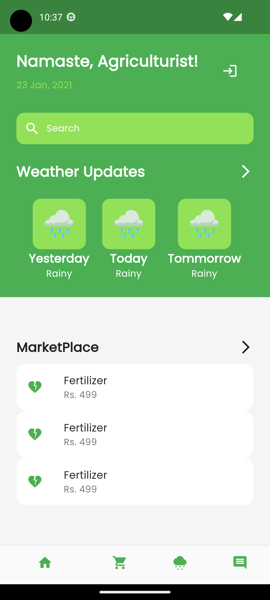

# Team-NKS

A comprehensive solution for farmers and people who want to grow on land, which aims to empower farmers by educating them & helping them make imformed decisions that increases their income.

Agrify aims to act as a brigde between agriculture and technology. Our aim is to make farming not seen as an option of last resort, but rather a vacation of choice.

## Contributors 👨‍💻
```
Nishant Pokhrel             
Krishant Timilsina   
Sushill Adhikari
```

## Screenshot



## 🔨 Build

###  📋 Requirements

To setup and use the project you will need to have the following tools installed:
 - [Flutter](https://docs.flutter.dev/get-started/install)

###  ⬇️ Installation

Clone the repository

```bash
$ git clone https://github.com/U-Tec-Hackathon-Alpha/Team-NKS.git
```


Change the working directory to the newly cloned repository:

```bash
$ cd Team-NKS/agrify
```

Run pub get to install the dependencies :

```bash
$ flutter pub get

```

Run the project after it has been built:

```bash
$ flutter run
```
